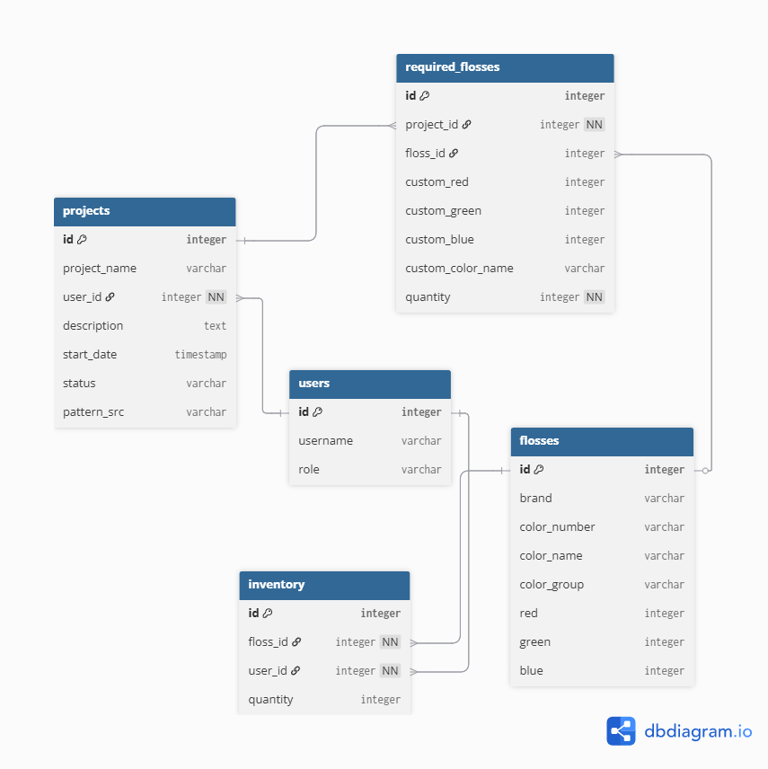
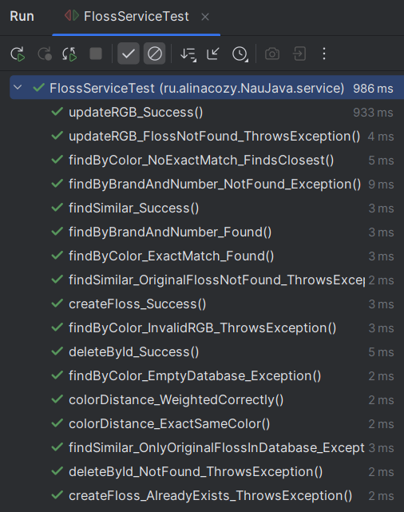
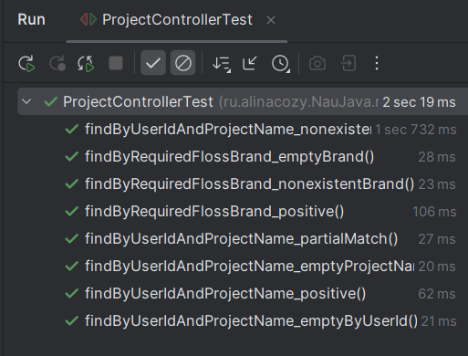
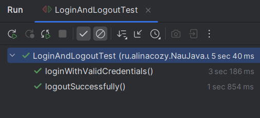

# Содержание
- [Практическая работа 4 (База данных)](#практическая-работа-4-база-данных)
- [Практическая работа 5 (REST)](#практическая-работа-5-rest)
- [Практическая работа 6 (Spring Security)](#практическая-работа-6-spring-security)
- [Практическая работа 7 (Многопоточность и асинхронность)](#практическая-работа-7-многопоточность-и-асинхронность)
- [Практическая работа 8 (автоматизированное тестирование)](#практическая-работа-8-автоматизированное-тестирование)

---

# Практическая работа 4 (База данных)
## Диаграмма структуры базы данных:


### Данная структура содержит 5 сущностей:
1. `Floss` - сущность нитки (конкретного цвета в каталоге бренда). Содержит информацию о бренде, номере цвета, названии цвета, цветовой группе и эквивалент в RGB. Связь с `inventory` - 1 ко многим, связь с `required_flosses` - 1 ко многим.
2. `User` - пользователь. Содержит username и роль. Связь с `inventory` - 1 ко многим, связь с `projects` - 1 ко многим.
3. `Inventory` - запись о том, какое количество данной нитки есть у пользователя (в метрах). Связь с пользователем: многие к 1, с `floss` - многие к 1
4. `Project` - проект, относящийся к конкретному пользователю. Здесь пользователь указывает название проекта, описание, статус (готов/в процессе/не начат), ссылку на схему, а также, какие нитки нужны для проекта в каком количестве. Связь с пользователем - многие к 1, связь с `required_flosses` - 1 ко многим.
5. `RequiredFloss` - сущность нитки, необходимой для конкретного проекта. Можно будет задать как конкретную нитку из каталога (связь с таблицей `flosses`), так и просто кастомный цвет RGB (т.к. бывают схемы для вышивки, где не указаны эталонные номера ниток из каталогов). Также данная сущность содержит количество данной нитки, необходимое для проекта, что в дальнейшем позволит посмотреть, каких ниток пользователю не хватает. Связь с `projects` - многие к 1, связь с `flosses` - многие к 1.

При запуске приложения проверяется, пуста ли база данных, и в этом случае она заполняется тестовыми данными.

# Практическая работа 5 (REST)

Все методы репозиториев доступны по REST с помощью Spring Data Rest.

Также реализованы кастомные контроллеры:
1. `ProjectController` для методов кастомного репозитория
2. `FlossControllerView` для отображения списка объектов Floss в виде таблицы.
3. `ExceptionControllerAdvice` для единообразия обработки исключений

Список всех доступных endpoints можно увидеть с помощью SwaggerUI по URL: `/swagger-ui/index.html`

# Практическая работа 6 (Spring Security)

- произвольный пользователь может зарегистрироваться в системе
(реализован шаблон регистрации и контроллер). Регистрация доступна по URL `/register`.
- пароли новых пользователей хранятся в зашифрованном виде. Используется `BCryptPasswordEncoder`.
- неавторизованному пользователю не доступны ресурсы приложения
  и в случае попытки получить доступ осуществляется переход на
  страницу авторизации (`/login`).
- swagger-ui доступен только пользователю с ролью `ADMIN`.
при попытке доступа к endpoints swagger-ui пользователем с ролью `USER` возвращается объект `ExceptionDTO`.
- пользователь может выйти из системы. Выход осуществляется POST-запросом по URL `/logout`. 
Кнопка выхода находится на основной странице со списком всех ниток `/custom/floss/view/list`.

# Практическая работа 7 (Многопоточность и асинхронность)

Реализованы сущность Report, ReportService и ReportController, позволяющие формировать отчеты о работе приложения.

Отчет представлен в формате HTML и содержит:
1. количество зарегистрированных в системе
   пользователей.
2. список объектов ниток.
3. время, затраченное на вычисление 1
   пункта.
4. время, затраченное на вычисление 2
   пункта.
5. общее время, затраченное на формирование
   отчета.

Отчет может создать или получить только пользователь с ролью `ADMIN`.
Для удобства тестирования через curl или postman добавлена аутентификация httpBasic.


Создание отчета и запуск асинхронной генерации осуществляются с помощью
POST-запроса на URL `/reports/create`. 
Формат ответа сервера: `{"reportId":<id>}`

Получение отчета по id осуществляется с помощью
GET-запроса по URL `/reports/<reportId>` (вставить ID отчета). 
Формат ответа сервера: строка в формате HTML с отчетом.


Например, с помощью curl:

- Создание отчета (и запуск асинхронной генерации):
```bash
curl -X POST http://localhost:8080/reports/create -u <admin>:<password>
```

- Получение отчета по id:

```bash
curl -X GET http://localhost:8080/reports/<reportId> -u <admin>:<password>
```

Также добавлена обработка ошибка 405 Method not allowed в едином формате обработки ошибок

# Практическая работа 8 (автоматизированное тестирование)

- написаны unit-тесты на сервис FlossServiceImpl с помощью JUnit и Mockito
- написаны rest assured тесты на контроллер ProjectController
- написан UI-тест на кейс с авторизацией с помощью Selenium

Ниже представлены скриншоты успешного запуска написанных тестов.

### Юнит-тесты

### RestAssured тесты

### UI-тесты
